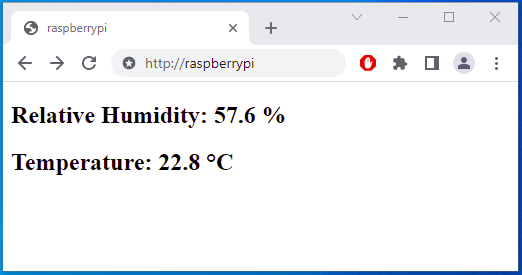

# Si7021PythonWebserver
Website showing Si7021 temperature and relative humidity measurements. (Python, Raspberry Pi)

## Setup
- Enable Raspberry Pi I2C using: `sudo raspi-config nonint do_i2c 0`
- Connect sensor to Raspberry Pi
- Ensure smbus and flask are installed: `pip3 install smbus flask`
- Store `si7021_webserver.py` to `/home/<INSERT YOUR USERNAME HERE>/si7021sensor/si7021_webserver.py`
- run `python3 /home/<INSERT YOUR USERNAME HERE>/si7021sensor/si7021_webserver.py`
- open website via browser: `http://<RaspberryPisIP>`

## [Optionally] Setup a systemd service for auto start when booting Raspberry Pi
- Modify `si7021_webserver.service` according to hints within file
- Store `si7021_webserver.service` to `/lib/systemd/system/si7021_webserver.service` 
- set permission `sudo chmod 644 /lib/systemd/system/si7021_webserver.service`
- reload `sudo systemctl daemon-reload`
- enable auto start `sudo systemctl enable si7021_webserver.service`
- reboot `sudo reboot`
- after reboot the service should start automatically.

## Warning
Flasks webserver is a development webserver. Use a production WSGI server for non-private networks.
